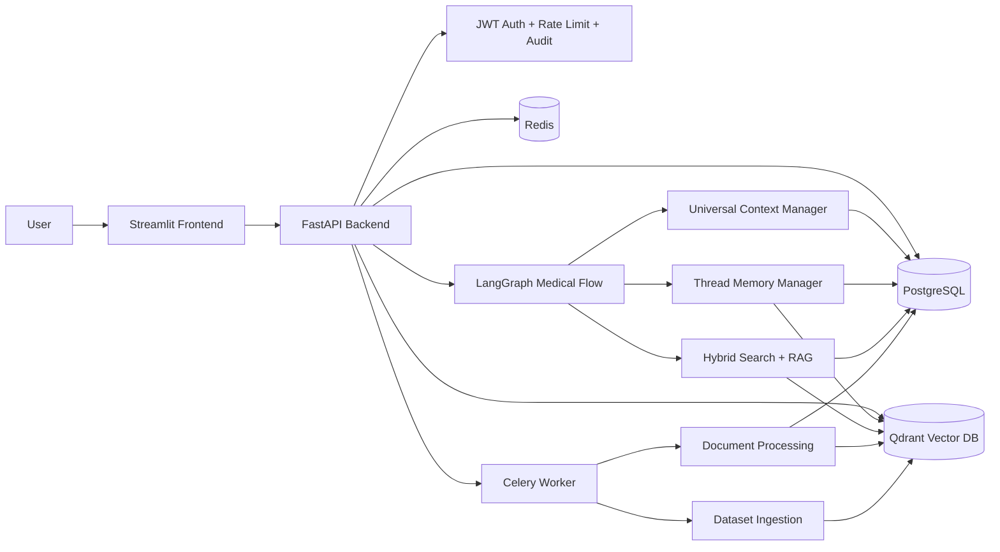

# AI-Powered-Medical-Chatbot

This repository contains a Dockerized healthcare AI platform with a Streamlit frontend, FastAPI backend, PostgreSQL persistence, Redis caching and queues, Celery workers, Qdrant vector search, LangGraph/LangChain orchestration, universal health memory, thread memory, document ingestion, and medical dataset indexing.

> Safety boundary: the assistant provides educational information and care-navigation support. It does not diagnose, prescribe, or replace licensed clinical care.

## Architecture



## Folder Structure

```text
backend/
  app/
    core/              security, config, rate limiting, prompt guard
    datasets/          disease, medication, nutrition, guideline ingestion
    db/                async SQLAlchemy session
    langgraph/         medical response graph
    middleware/        tracing and audit logging
    models/            SQLAlchemy database schema
    repositories/      persistence access layer
    routers/           FastAPI endpoints
    services/          memory, RAG, extraction, documents, response engine
    vectorstore/       embeddings and Qdrant integration
    workers/           Celery app and background tasks
  migrations/          Alembic migration environment
  tests/               unit, API, and schema tests
frontend/
  app.py               Streamlit UI
  services/api.py      backend client
data/
  raw/                 starter medical datasets
  processed/           normalized ingestion snapshots
  vectorized/          knowledge indexing manifest
docker/
  Dockerfile.backend
  Dockerfile.frontend
database/
  init.sql
scripts/
```

## Database Schema

The SQLAlchemy metadata defines:

- `users`: account identity, role, password hash, active status.
- `conversation_threads`: unlimited user-owned threads with summary and soft-delete state.
- `messages`: raw user and assistant messages with metadata and indexes for high-volume retrieval.
- `health_profiles`: cross-thread demographics, vitals, lifestyle, nutrition preferences.
- `conditions`, `symptoms`, `medications`, `allergies`: deduplicated extracted medical entities linked to a profile.
- `documents`: uploaded file metadata and processing status.
- `document_chunks`: normalized chunks for RAG.
- `embeddings`: relational references to Qdrant point IDs for messages and chunks.
- `audit_logs`: immutable request and security audit records.

All tables use UUID primary keys, timestamps, foreign keys, and indexes on common production access paths.

## Runtime Flow

1. User authenticates through JWT.
2. Chat message is validated by the prompt guard.
3. Message is stored in the selected conversation thread.
4. `HealthExtractor` updates universal medical memory.
5. `UniversalContextManager` loads cross-thread health profile facts.
6. `ThreadMemoryManager` loads recent messages, summary, and semantic thread memories.
7. `HybridSearchEngine` combines PostgreSQL keyword search and Qdrant semantic search.
8. `MedicalResponseEngine` runs the LangGraph flow and returns a grounded answer with the required disclaimer.

## API Endpoints

- `POST /auth/register`
- `POST /auth/login`
- `POST /thread/create`
- `GET /threads`
- `GET /thread/{id}`
- `DELETE /thread/{id}`
- `PUT /thread/{id}`
- `POST /chat`
- `POST /upload-document`
- `GET /documents`
- `GET /health-profile`
- `PUT /health-profile`
- `GET /audit-logs`
- `GET /health`
- `GET /metrics`

## Start Locally

```bash
cp .env.example .env
docker compose up --build
```

Open:

- Frontend: http://localhost:8501
- Backend API docs: http://localhost:8000/docs
- Qdrant dashboard: http://localhost:6333/dashboard

## Tests

```bash
cd backend
pytest
```

## Dataset Integration

The platform ships with starter curated CSV datasets in `data/raw`. Replace or extend these files with larger disease, medication, nutrition, clinical guideline, WHO, and CDC datasets. On backend startup, `knowledge_initializer.py` checks Qdrant collections, fingerprints `data/raw`, chunks and embeds changed records, and writes `data/vectorized/knowledge_manifest.json`.

## Production Notes

- Replace `JWT_SECRET_KEY` before deployment.
- Put PostgreSQL, Redis, and Qdrant on managed or persistent infrastructure for production workloads.
- Configure `OPENAI_API_KEY` for hosted LLM and embedding calls. Without it, the platform runs with deterministic local embeddings and conservative local response generation.
- Run multiple backend and worker replicas behind a load balancer.
- Keep `audit_logs` retention aligned with organizational policy and healthcare regulations.
- Treat all uploaded documents and health data as sensitive data requiring encryption, access controls, retention policy, and compliance review.
